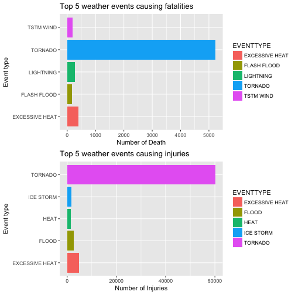
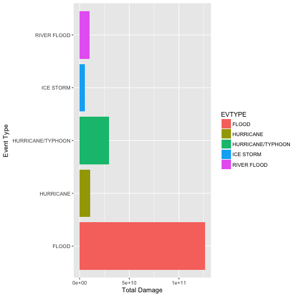

## Synopsis
Storms and other severe weather events can cause both public health and economic problems for communities and municipalities. Many severe events can result in fatalities, injuries, and property damage, and preventing such outcomes to the extent possible is a key concern.

This project involves exploring the U.S. National Oceanic and Atmospheric Administration's (NOAA) storm database. This database tracks characteristics of major storms and weather events in the United States, including when and where they occur, as well as estimates of any fatalities, injuries, and property damage.

Two research questions are: 1. Across the United States, which types of events are most harmful with respect to population health? 2. Across the United States, which types of events have the greatest economic consequences?

Analysis results show that Tornado is the most harmful event in terms of human fatalites and injuries;Floods have the greatest economic consequences.

## Loading and Processing the Raw Data
The data are downloaded from NOAA Storm Database

```r
if (!file.exists('./storm_data')) {dir.create('./storm_data') }
if (!file.exists("storm_data/repdata-data-StormData.csv.bz2")) {
  download.file("https://d396qusza40orc.cloudfront.net/repdata%2Fdata%2FStormData.csv.bz2", destfile="storm_data/repdata-data-StormData.csv.bz2", mode = "wb",  method = "curl")
}
if (!exists('storm_data')) {
  storm_data <- read.csv("storm_data/repdata-data-StormData.csv.bz2")
}
```
## summary of data and its structure

```r
str(storm_data)
```

```
## 'data.frame':	902297 obs. of  37 variables:
##  $ STATE__   : num  1 1 1 1 1 1 1 1 1 1 ...
##  $ BGN_DATE  : Factor w/ 16335 levels "1/1/1966 0:00:00",..: 6523 6523 4242 11116 2224 2224 2260 383 3980 3980 ...
##  $ BGN_TIME  : Factor w/ 3608 levels "00:00:00 AM",..: 272 287 2705 1683 2584 3186 242 1683 3186 3186 ...
##  $ TIME_ZONE : Factor w/ 22 levels "ADT","AKS","AST",..: 7 7 7 7 7 7 7 7 7 7 ...
##  $ COUNTY    : num  97 3 57 89 43 77 9 123 125 57 ...
##  $ COUNTYNAME: Factor w/ 29601 levels "","5NM E OF MACKINAC BRIDGE TO PRESQUE ISLE LT MI",..: 13513 1873 4598 10592 4372 10094 1973 23873 24418 4598 ...
##  $ STATE     : Factor w/ 72 levels "AK","AL","AM",..: 2 2 2 2 2 2 2 2 2 2 ...
##  $ EVTYPE    : Factor w/ 985 levels "   HIGH SURF ADVISORY",..: 834 834 834 834 834 834 834 834 834 834 ...
##  $ BGN_RANGE : num  0 0 0 0 0 0 0 0 0 0 ...
##  $ BGN_AZI   : Factor w/ 35 levels "","  N"," NW",..: 1 1 1 1 1 1 1 1 1 1 ...
##  $ BGN_LOCATI: Factor w/ 54429 levels ""," Christiansburg",..: 1 1 1 1 1 1 1 1 1 1 ...
##  $ END_DATE  : Factor w/ 6663 levels "","1/1/1993 0:00:00",..: 1 1 1 1 1 1 1 1 1 1 ...
##  $ END_TIME  : Factor w/ 3647 levels ""," 0900CST",..: 1 1 1 1 1 1 1 1 1 1 ...
##  $ COUNTY_END: num  0 0 0 0 0 0 0 0 0 0 ...
##  $ COUNTYENDN: logi  NA NA NA NA NA NA ...
##  $ END_RANGE : num  0 0 0 0 0 0 0 0 0 0 ...
##  $ END_AZI   : Factor w/ 24 levels "","E","ENE","ESE",..: 1 1 1 1 1 1 1 1 1 1 ...
##  $ END_LOCATI: Factor w/ 34506 levels ""," CANTON"," TULIA",..: 1 1 1 1 1 1 1 1 1 1 ...
##  $ LENGTH    : num  14 2 0.1 0 0 1.5 1.5 0 3.3 2.3 ...
##  $ WIDTH     : num  100 150 123 100 150 177 33 33 100 100 ...
##  $ F         : int  3 2 2 2 2 2 2 1 3 3 ...
##  $ MAG       : num  0 0 0 0 0 0 0 0 0 0 ...
##  $ FATALITIES: num  0 0 0 0 0 0 0 0 1 0 ...
##  $ INJURIES  : num  15 0 2 2 2 6 1 0 14 0 ...
##  $ PROPDMG   : num  25 2.5 25 2.5 2.5 2.5 2.5 2.5 25 25 ...
##  $ PROPDMGEXP: Factor w/ 19 levels "","-","?","+",..: 17 17 17 17 17 17 17 17 17 17 ...
##  $ CROPDMG   : num  0 0 0 0 0 0 0 0 0 0 ...
##  $ CROPDMGEXP: Factor w/ 9 levels "","?","0","2",..: 1 1 1 1 1 1 1 1 1 1 ...
##  $ WFO       : Factor w/ 542 levels ""," CI","%SD",..: 1 1 1 1 1 1 1 1 1 1 ...
##  $ STATEOFFIC: Factor w/ 250 levels "","ALABAMA, Central",..: 1 1 1 1 1 1 1 1 1 1 ...
##  $ ZONENAMES : Factor w/ 25112 levels "","                                                                                                                               "| __truncated__,..: 1 1 1 1 1 1 1 1 1 1 ...
##  $ LATITUDE  : num  3040 3042 3340 3458 3412 ...
##  $ LONGITUDE : num  8812 8755 8742 8626 8642 ...
##  $ LATITUDE_E: num  3051 0 0 0 0 ...
##  $ LONGITUDE_: num  8806 0 0 0 0 ...
##  $ REMARKS   : Factor w/ 436781 levels "","\t","\t\t",..: 1 1 1 1 1 1 1 1 1 1 ...
##  $ REFNUM    : num  1 2 3 4 5 6 7 8 9 10 ...
```

```r
summary(storm_data)
```

```
##     STATE__                  BGN_DATE             BGN_TIME     
##  Min.   : 1.0   5/25/2011 0:00:00:  1202   12:00:00 AM: 10163  
##  1st Qu.:19.0   4/27/2011 0:00:00:  1193   06:00:00 PM:  7350  
##  Median :30.0   6/9/2011 0:00:00 :  1030   04:00:00 PM:  7261  
##  Mean   :31.2   5/30/2004 0:00:00:  1016   05:00:00 PM:  6891  
##  3rd Qu.:45.0   4/4/2011 0:00:00 :  1009   12:00:00 PM:  6703  
##  Max.   :95.0   4/2/2006 0:00:00 :   981   03:00:00 PM:  6700  
##                 (Other)          :895866   (Other)    :857229  
##    TIME_ZONE          COUNTY           COUNTYNAME         STATE       
##  CST    :547493   Min.   :  0.0   JEFFERSON :  7840   TX     : 83728  
##  EST    :245558   1st Qu.: 31.0   WASHINGTON:  7603   KS     : 53440  
##  MST    : 68390   Median : 75.0   JACKSON   :  6660   OK     : 46802  
##  PST    : 28302   Mean   :100.6   FRANKLIN  :  6256   MO     : 35648  
##  AST    :  6360   3rd Qu.:131.0   LINCOLN   :  5937   IA     : 31069  
##  HST    :  2563   Max.   :873.0   MADISON   :  5632   NE     : 30271  
##  (Other):  3631                   (Other)   :862369   (Other):621339  
##                EVTYPE         BGN_RANGE           BGN_AZI      
##  HAIL             :288661   Min.   :   0.000          :547332  
##  TSTM WIND        :219940   1st Qu.:   0.000   N      : 86752  
##  THUNDERSTORM WIND: 82563   Median :   0.000   W      : 38446  
##  TORNADO          : 60652   Mean   :   1.484   S      : 37558  
##  FLASH FLOOD      : 54277   3rd Qu.:   1.000   E      : 33178  
##  FLOOD            : 25326   Max.   :3749.000   NW     : 24041  
##  (Other)          :170878                      (Other):134990  
##          BGN_LOCATI                  END_DATE             END_TIME     
##               :287743                    :243411              :238978  
##  COUNTYWIDE   : 19680   4/27/2011 0:00:00:  1214   06:00:00 PM:  9802  
##  Countywide   :   993   5/25/2011 0:00:00:  1196   05:00:00 PM:  8314  
##  SPRINGFIELD  :   843   6/9/2011 0:00:00 :  1021   04:00:00 PM:  8104  
##  SOUTH PORTION:   810   4/4/2011 0:00:00 :  1007   12:00:00 PM:  7483  
##  NORTH PORTION:   784   5/30/2004 0:00:00:   998   11:59:00 PM:  7184  
##  (Other)      :591444   (Other)          :653450   (Other)    :622432  
##    COUNTY_END COUNTYENDN       END_RANGE           END_AZI      
##  Min.   :0    Mode:logical   Min.   :  0.0000          :724837  
##  1st Qu.:0    NA's:902297    1st Qu.:  0.0000   N      : 28082  
##  Median :0                   Median :  0.0000   S      : 22510  
##  Mean   :0                   Mean   :  0.9862   W      : 20119  
##  3rd Qu.:0                   3rd Qu.:  0.0000   E      : 20047  
##  Max.   :0                   Max.   :925.0000   NE     : 14606  
##                                                 (Other): 72096  
##            END_LOCATI         LENGTH              WIDTH         
##                 :499225   Min.   :   0.0000   Min.   :   0.000  
##  COUNTYWIDE     : 19731   1st Qu.:   0.0000   1st Qu.:   0.000  
##  SOUTH PORTION  :   833   Median :   0.0000   Median :   0.000  
##  NORTH PORTION  :   780   Mean   :   0.2301   Mean   :   7.503  
##  CENTRAL PORTION:   617   3rd Qu.:   0.0000   3rd Qu.:   0.000  
##  SPRINGFIELD    :   575   Max.   :2315.0000   Max.   :4400.000  
##  (Other)        :380536                                         
##        F               MAG            FATALITIES          INJURIES        
##  Min.   :0.0      Min.   :    0.0   Min.   :  0.0000   Min.   :   0.0000  
##  1st Qu.:0.0      1st Qu.:    0.0   1st Qu.:  0.0000   1st Qu.:   0.0000  
##  Median :1.0      Median :   50.0   Median :  0.0000   Median :   0.0000  
##  Mean   :0.9      Mean   :   46.9   Mean   :  0.0168   Mean   :   0.1557  
##  3rd Qu.:1.0      3rd Qu.:   75.0   3rd Qu.:  0.0000   3rd Qu.:   0.0000  
##  Max.   :5.0      Max.   :22000.0   Max.   :583.0000   Max.   :1700.0000  
##  NA's   :843563                                                           
##     PROPDMG          PROPDMGEXP        CROPDMG          CROPDMGEXP    
##  Min.   :   0.00          :465934   Min.   :  0.000          :618413  
##  1st Qu.:   0.00   K      :424665   1st Qu.:  0.000   K      :281832  
##  Median :   0.00   M      : 11330   Median :  0.000   M      :  1994  
##  Mean   :  12.06   0      :   216   Mean   :  1.527   k      :    21  
##  3rd Qu.:   0.50   B      :    40   3rd Qu.:  0.000   0      :    19  
##  Max.   :5000.00   5      :    28   Max.   :990.000   B      :     9  
##                    (Other):    84                     (Other):     9  
##       WFO                                       STATEOFFIC    
##         :142069                                      :248769  
##  OUN    : 17393   TEXAS, North                       : 12193  
##  JAN    : 13889   ARKANSAS, Central and North Central: 11738  
##  LWX    : 13174   IOWA, Central                      : 11345  
##  PHI    : 12551   KANSAS, Southwest                  : 11212  
##  TSA    : 12483   GEORGIA, North and Central         : 11120  
##  (Other):690738   (Other)                            :595920  
##                                                                                                                                                                                                     ZONENAMES     
##                                                                                                                                                                                                          :594029  
##                                                                                                                                                                                                          :205988  
##  GREATER RENO / CARSON CITY / M - GREATER RENO / CARSON CITY / M                                                                                                                                         :   639  
##  GREATER LAKE TAHOE AREA - GREATER LAKE TAHOE AREA                                                                                                                                                       :   592  
##  JEFFERSON - JEFFERSON                                                                                                                                                                                   :   303  
##  MADISON - MADISON                                                                                                                                                                                       :   302  
##  (Other)                                                                                                                                                                                                 :100444  
##     LATITUDE      LONGITUDE        LATITUDE_E     LONGITUDE_    
##  Min.   :   0   Min.   :-14451   Min.   :   0   Min.   :-14455  
##  1st Qu.:2802   1st Qu.:  7247   1st Qu.:   0   1st Qu.:     0  
##  Median :3540   Median :  8707   Median :   0   Median :     0  
##  Mean   :2875   Mean   :  6940   Mean   :1452   Mean   :  3509  
##  3rd Qu.:4019   3rd Qu.:  9605   3rd Qu.:3549   3rd Qu.:  8735  
##  Max.   :9706   Max.   : 17124   Max.   :9706   Max.   :106220  
##  NA's   :47                      NA's   :40                     
##                                            REMARKS           REFNUM      
##                                                :287433   Min.   :     1  
##                                                : 24013   1st Qu.:225575  
##  Trees down.\n                                 :  1110   Median :451149  
##  Several trees were blown down.\n              :   568   Mean   :451149  
##  Trees were downed.\n                          :   446   3rd Qu.:676723  
##  Large trees and power lines were blown down.\n:   432   Max.   :902297  
##  (Other)                                       :588295
```
## data processing and cleaning, creating subset including relevant columns (variables) and rows (data)

```r
storm_subset=select(storm_data, EVTYPE, FATALITIES, INJURIES, PROPDMG, PROPDMGEXP, CROPDMG, CROPDMGEXP)
# subset data for Question 1
eventHealth <- subset(storm_subset, !storm_subset$FATALITIES == 0 & !storm_subset$INJURIES == 
    0, select = c(EVTYPE, FATALITIES, INJURIES))
# subset data for Question 2
eventEconomic <- subset(storm_subset, !storm_subset$PROPDMG == 0 & !storm_subset$CROPDMG == 
    0, select = c(EVTYPE, PROPDMG, PROPDMGEXP, CROPDMG, CROPDMGEXP))
```
## RQ1. Across the United States, which types of events (as indicated in the EVTYPE variable) are most harmful with respect to population health? First, I calculate total number of FATALITIES and INJURIES frequency grouped by event types; then I select the top 5 events causing death and injuries; finally plot the top 5 major cause for fatalities and injuriees respectively. The resuts revealed that tornadoe is the most dangerous weather event to the populations health.

```r
library(dplyr)
library(ggplot2)
# calculate sum of FATALITIES and INJURIES grouped by EVTYPE
event_death=eventHealth %>% group_by(EVTYPE) %>%
  summarise(sum_death = sum(FATALITIES, na.rm = TRUE))
colnames(event_death) <- c("EVENTTYPE", "FATALITIES") 
event_inj=eventHealth %>% group_by(EVTYPE) %>%
  summarise(sum_inj = sum(INJURIES, na.rm = TRUE))
colnames(event_inj) = c("EVENTTYPE", "INJURIES")
#reorder dataset and filter top 5 events 
event_death <- event_death[order(event_death$FATALITIES, decreasing = TRUE), ][1:5, ]
event_death
```

```
## # A tibble: 5 × 2
##        EVENTTYPE FATALITIES
##           <fctr>      <dbl>
## 1        TORNADO       5227
## 2 EXCESSIVE HEAT        402
## 3      LIGHTNING        283
## 4      TSTM WIND        199
## 5    FLASH FLOOD        171
```

```r
event_inj <- event_inj[order(event_inj$INJURIES, decreasing = TRUE), ][1:5, ]
event_inj
```

```
## # A tibble: 5 × 2
##        EVENTTYPE INJURIES
##           <fctr>    <dbl>
## 1        TORNADO    60187
## 2 EXCESSIVE HEAT     4791
## 3          FLOOD     2679
## 4      ICE STORM     1720
## 5           HEAT     1420
```

```r
# plot top 5 major cause for fatalities and injuriees respectively
death_plot=ggplot(data = event_death, aes(x = factor(EVENTTYPE), y = event_death$FATALITIES, fill = EVENTTYPE)) + geom_bar(stat="identity") + coord_flip() + labs(y = "Number of Death", x = "Event type", title = "Top 5 weather events causing fatalities")
injury_plot=ggplot(data = event_inj, aes(x = factor(EVENTTYPE), y = event_inj$INJURIES, fill = EVENTTYPE)) + geom_bar(stat="identity") + coord_flip() + labs(y = "Number of Injuries", x = "Event type", title = "Top 5 weather events causing injuries")
grid.arrange(death_plot, injury_plot, nrow = 2)
```


## RQ2. Across the United States, which types of events have the greatest economic consequences? I first did data Processing, then plot the dataset out. Results showed floods have the greatest economic consequences.

```r
library(stats)
eventEconomic$PROPMULT<-1

eventEconomic$PROPMULT[eventEconomic$PROPDMGEXP =="H"] <- 100
eventEconomic$PROPMULT[eventEconomic$PROPDMGEXP =="K"] <- 1000
eventEconomic$PROPMULT[eventEconomic$PROPDMGEXP =="M"] <- 1000000
eventEconomic$PROPMULT[eventEconomic$PROPDMGEXP =="B"] <- 1000000000

eventEconomic$CROPMULT<-1

eventEconomic$CROPMULT[eventEconomic$CROPDMGEXP =="H"] <- 100
eventEconomic$CROPMULT[eventEconomic$CROPDMGEXP =="K"] <- 1000
eventEconomic$CROPMULT[eventEconomic$CROPDMGEXP =="M"] <- 1000000
eventEconomic$CROPMULT[eventEconomic$CROPDMGEXP =="B"] <- 1000000000
str(eventEconomic)
```

```
## 'data.frame':	16242 obs. of  7 variables:
##  $ EVTYPE    : Factor w/ 985 levels "   HIGH SURF ADVISORY",..: 409 786 405 408 408 786 786 834 834 812 ...
##  $ PROPDMG   : num  0.1 5 25 48 20 50 500 500 500 5 ...
##  $ PROPDMGEXP: Factor w/ 19 levels "","-","?","+",..: 14 19 19 19 18 17 17 17 17 17 ...
##  $ CROPDMG   : num  10 500 1 4 10 50 50 5 50 15 ...
##  $ CROPDMGEXP: Factor w/ 9 levels "","?","0","2",..: 9 7 9 9 8 7 7 7 7 7 ...
##  $ PROPMULT  : num  1e+09 1e+06 1e+06 1e+06 1e+00 1e+03 1e+03 1e+03 1e+03 1e+03 ...
##  $ CROPMULT  : num  1e+06 1e+03 1e+06 1e+06 1e+00 1e+03 1e+03 1e+03 1e+03 1e+03 ...
```

```r
eventEconomic$PRODMG1 <- eventEconomic$PROPDMG * eventEconomic$PROPMULT
eventEconomic$CROPDMG1 <- eventEconomic$CROPDMG * eventEconomic$CROPMULT

eventEconomic <- aggregate(cbind(PRODMG1, CROPDMG1) ~ EVTYPE, data=eventEconomic, FUN=sum)

eventEconomic$TOTALDMG <- eventEconomic$PRODMG1 + eventEconomic$CROPDMG1

eventEconomic <- aggregate(eventEconomic$TOTALDMG, by = list(eventEconomic$EVTYPE), 
    FUN = sum)

colnames(eventEconomic) <- c("EVTYPE", "TOTALDMG")

# Rank the event type by highest damage cost and take top 5 columns
eventEconomic <- eventEconomic[order(eventEconomic$TOTALDMG, decreasing = TRUE), 
    ]
eventEconomic <- eventEconomic[1:5, ]

#plot
ggplot(data = eventEconomic, aes(x = factor(EVTYPE), y = TOTALDMG, fill =EVTYPE)) + 
         geom_bar(stat = "identity") + coord_flip() + xlab("Event Type") + ylab("Total Damage")
```


## Results
Analysis results show that Tornado is the most harmful event in terms of human fatalites and injuries;Floods have the greatest economic consequences.